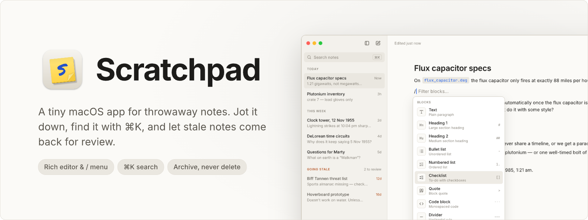
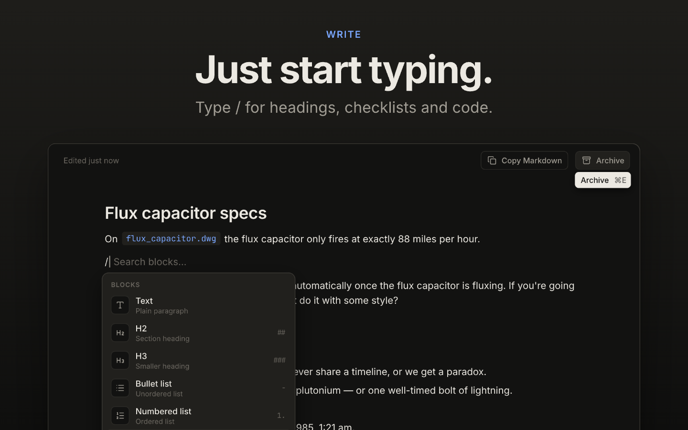
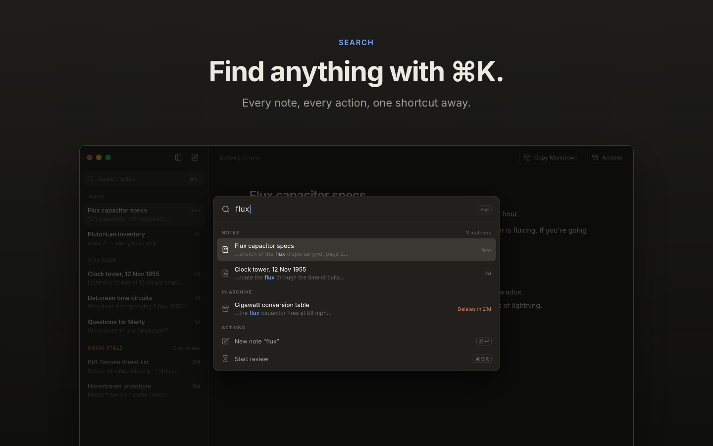
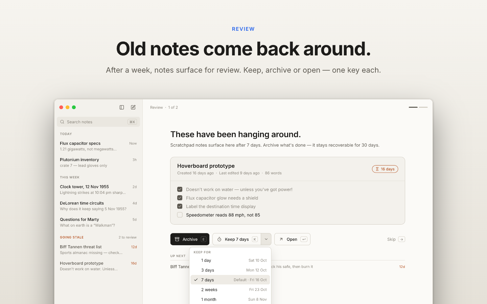
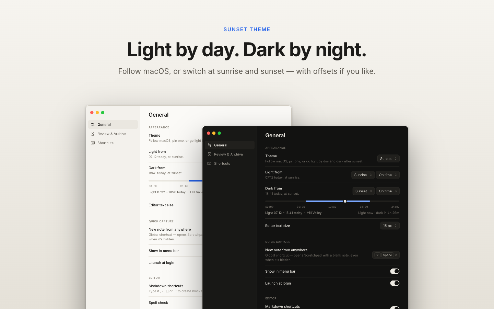
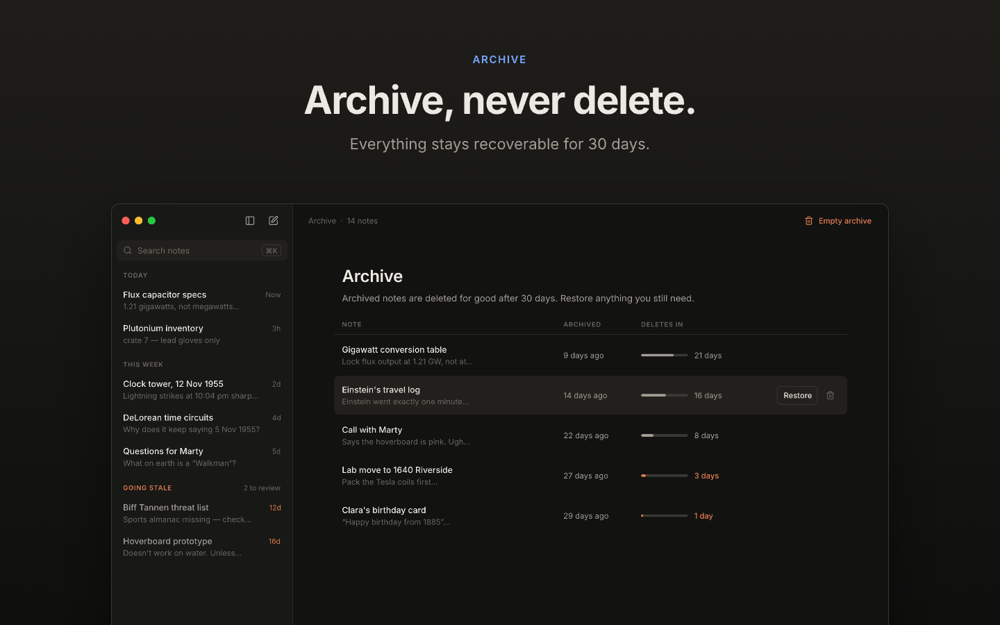

<picture>
  <source media="(prefers-color-scheme: dark)" srcset=".github/banner-dark.png">
  
</picture>

# Scratchpad

**[Installation](#installation)** · **[Documentation](#documentation)** · **[Contributing](#contributing)**

A small macOS app for the notes you never meant to keep: a phone number for the next ten minutes, a shopping list, the snippet you're about to paste somewhere else. You know, the stuff currently living in eleven unsaved TextEdit windows, each one guarding its contents behind a "Do you want to save?" prompt.

Scratchpad gives those notes somewhere to go, and then politely shows them the door. Anything you haven't touched in a week comes back for a quick review, you archive what's done, and the archive tidies itself up after 30 days. Nothing goes without fair warning.

- **Local only.** Notes never leave your Mac. No account, no sync, no analytics, no network requests at all.
- **One rich editor.** Type `/` for headings, lists, checklists, quotes and code, or just use Markdown shortcuts.
- **Saves as you type.** No save button, and no prompts asking whether you'd like to.
- **Notes that age out.** Stale after a week, archived when you say so, deleted 30 days later.
- **Review.** Walk through stale notes one key at a time: archive, keep or open.
- **⌘K search.** Every note, archived ones included, plus the app's actions.
- **Capture from anywhere.** ⌥Space opens a new note, even when the app is hidden.
- **Markdown out.** Copy a selection or a whole note as Markdown, or export everything to `.md` files.
- **Sunset theme.** Light by day, dark after sunset, worked out on-device.
- **Remappable shortcuts.** All of them.



<p align="center">
  
  &nbsp;&nbsp;
  
</p>
<p align="center">
  
  &nbsp;&nbsp;
  
</p>

## Installation

Download `Scratchpad-<version>-macos.zip` from [Releases](../../releases), unzip it and move **Scratchpad** to Applications. It runs on Apple Silicon and Intel Macs.

The app isn't notarised by Apple, so macOS will refuse to open it the first time, with its usual air of mild suspicion. Either open **System Settings → Privacy & Security** and click **Open Anyway**, or run:

```sh
xattr -dr com.apple.quarantine /Applications/Scratchpad.app
```

If you'd rather not take a stranger's app on trust (fair), [build it yourself](#contributing).

## Local only

Your notes stay on your Mac. That's not a setting; it's the only way it works.

- Notes live in a single SQLite file on your disk, and nowhere else.
- The app makes no network requests. No account, no sync, no analytics, no crash reports, no update checks. It doesn't phone home because it doesn't have the number.
- The Sunset theme works out sunrise and sunset on-device from your time zone, or a city or coordinates you type in. It doesn't ask for Location Services.
- Reminders are plain macOS notifications, scheduled by the app itself.

The only way a note leaves your Mac is if you copy or export it.

## Documentation

### How notes age out

Every note goes through the same stages, so old notes don't quietly pile up:

1. **Active.** Notes you've edited recently, grouped in the sidebar under Today and This week.
2. **Going stale.** A note you haven't edited for 7 days drops to Going stale at the bottom of the sidebar, its age in orange.
3. **Review.** Review (⌘⇧R) walks through stale notes one at a time. **E** archives it, **K** keeps it (it comes back after 1 day to 1 month, or a date you pick), **↵** opens it.
4. **Archive.** Archived notes (⌘E) are out of the way but still searchable and can be restored. ⌘Z undoes an archive straight away.
5. **Deleted.** Archived notes are deleted for good after 30 days. You can delete one early (⌘⌫) or empty the archive if you're feeling decisive.

Both periods, the default keep length, a weekly nudge when notes are waiting for review and a Dock badge with the stale count can all be changed in Settings.

### Writing

- One rich-text editor. Each note starts with a title line, which is what the sidebar and search show.
- Type `/` for blocks: text, H2, H3, bullet and numbered lists, checklists, quotes, code blocks and dividers. Markdown shortcuts (`##`, `-`, `[]`, `>`, ` ``` `, `---`) work as you type, and can be turned off.
- Notes save as you type.
- ⌘C copies the selection as Markdown alongside the rich text, so it pastes sensibly in either kind of app. ⌘⇧C copies the whole note as Markdown.
- ⌥Space opens a new note from any app, even when Scratchpad is hidden.

### Finding notes

- ⌘K searches the title and text of every note, archived ones included, and runs actions such as New note, Review and Settings.
- ⌘⌥↑ and ⌘⌥↓ step through notes in sidebar order.
- ⌘S hides the sidebar. Move the pointer to the left edge to peek at it.

### Settings

Open with ⌘,.

- **General:** theme (System, Light, Dark, or Sunset: light between sunrise and sunset, with optional offsets), editor text size, the ⌥Space shortcut, menu bar icon, launch at login, Markdown shortcuts, spell check, and export.
- **Review & Archive:** when notes go stale, the default keep length, the review reminder, the Dock badge, and how long archived notes are kept.
- **Shortcuts:** every shortcut can be remapped.

### Shortcuts

| Action | Default |
| --- | --- |
| New note from anywhere | ⌥Space |
| New note | ⌘N |
| Search and actions | ⌘K |
| Show / hide sidebar | ⌘S |
| Previous / next note | ⌘⌥↑ / ⌘⌥↓ |
| Archive note | ⌘E |
| Undo archive | ⌘Z |
| Delete permanently (in Archive) | ⌘⌫ |
| Copy note as Markdown | ⌘⇧C |
| Review | ⌘⇧R |
| Archive | ⌘⇧A |
| Settings | ⌘, |

### Your data

Everything is in one file:

```
~/Library/Application Support/com.tdrayson.scratchpad/scratchpad.db
```

- **Back up:** copy that file while Scratchpad is closed.
- **Export:** Settings → General → Export all notes writes one Markdown file per note into a folder you choose.
- **Uninstall:** delete the app and that folder.

## Contributing

Issues and pull requests are welcome. To build it yourself you need [tinyjs](https://github.com/tarwin/tinyjsapp) and pnpm:

```sh
pnpm install
tinyjs dev            # run with hot reload
pnpm test             # unit and component tests
pnpm app:install      # build and replace /Applications/Scratchpad.app
pnpm app:release      # universal build, zipped into dist/release/
```

Built with tinyjs, Vue, Tailwind and TipTap.
